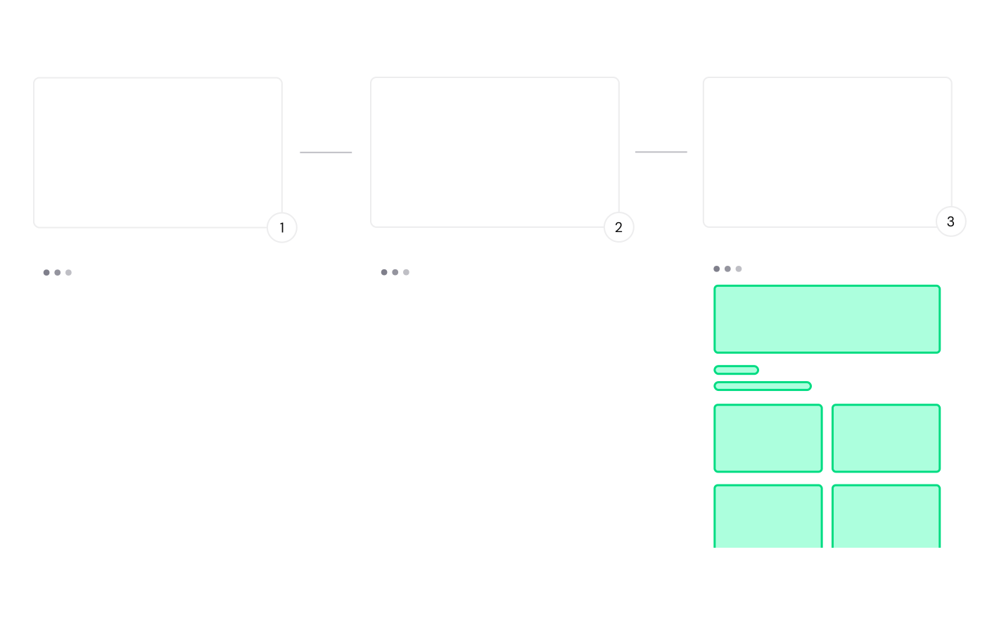
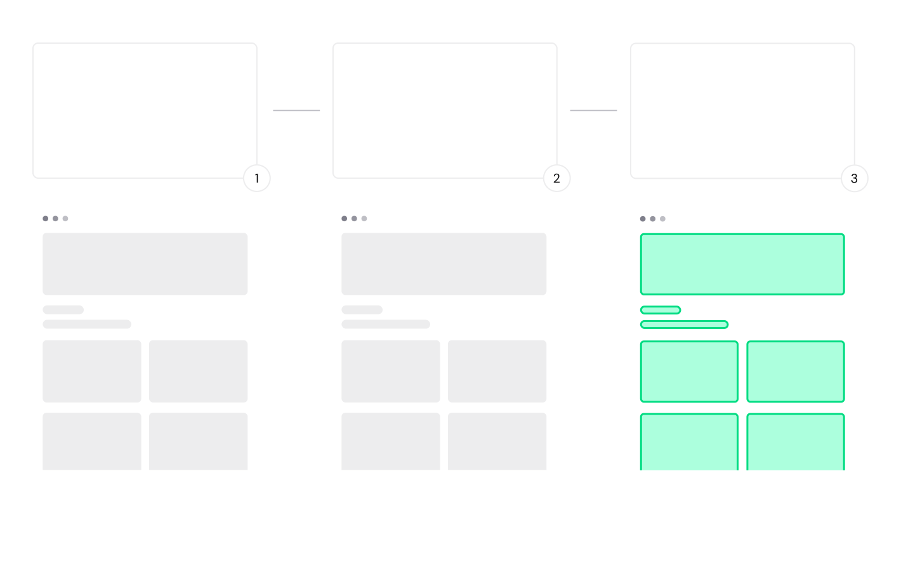

# Rendering Modes
ブラウザとサーバの両方が Vue.js のコンポーネントを HTML 要素で描画するために JavaScript のコードを受けとります。このステップをレンダリングと呼びます。Nuxt はサーバーサイドレンダリングとユニバーサルレンダリングの両方をポートしています。この2つのアプローチは長所（pros）と短所（cons）があり、このセクションで説明します。

## Client-side Only Rendering
追加設定が不要な、従来の Vue.js アプリケーションはブラウザ（またはクライアント）で再描画されます。そして、Vue.js はブラウザが現在のインタフェースを作成するための命令を含む全ての JavaScript コードをダウンロードし解析した後、HTML 要素を生成します。


この手法により、複雑で動的な UI を構築し、スムーズなページ遷移を実現しますが、これにはさまざまな長所と短所があります。

### Pros
- 開発スピード：完全にクライアントサイドで動く場合、`window` オブジェクトのようなブラウザ専用の API の使用などのコードのサーバ互換性を心配する必要がありません。
- 安価：JavaScript をサポートするプラットフォームで実行する必要があるため、サーバーを動かすとインフラストラクチャのコストが追加されます。クライアント専用のアプリケーションはHTML、CSS、JavaScript ファイルをもつ静的なサーバでホストすることができます。
- オフライン：コードは全てブラウザ上で実行されるため、インターネットが使用できなくてもうまく動作し続けることができます。

### Cons
- パフォーマンス：ユーザはブラウザがJavaScriptファイルをダウンロードし、解析し、実行のを待つ必要があります。ダウンロード部分はネットワークに依存しており、解析と実行はユーザのデバイスに依存するので、時間がかかり、ユーザエクスペリエンスに影響する可能性があります。
- 検索エンジン最適化：クライアントサイドレンダリングで配信されるコンテンツのインデックス作成と更新はサーバーサイドレンダリングの HTML ドキュメントよりも時間がかかります。これは先ほど説明したパフォーマンスの欠点と関係していて、検索エンジンのクローラーはインデックスを作成する最初の段階でインタフェースが完全に描画されるのを待ちません。検索結果ページでのコンテンツの表示と更新により時間がかかります。

### Examples
クライアントサイドレンダリングはインデックスの作成を必要としない、あるいはユーザが高頻度で訪れるような、高度にインタラクティブなウェブアプリケーションには良い選択です。SaaS、バックオフィスアプリケーション、オンラインゲームなど、ブラウザのキャッシュを活用して次回の訪問時にダウンロードフェーズをスキップすることができます。

## Universal Rendering
ユニバーサル（クライアントサイド + サーバーサイド）レンダリングを有効にしてブラウザが URL をリクエストした時、サーバーは完全に描画された HTML のページをブラウザに返します。事前にページが生成されキャッシュされていても、その場で描画されていても、ある時点で Nuxt はサーバー環境で JavaScript (Vue.js) のコードを実行し、HTML ドキュメントを生成します。ユーザーはクライアントサイドレンダリングとは異なり、アプリケーションのコンテンツをすぐに得ます。このステップは PHP や Ruby のアプリケーションで実行される従来のサーバーサイドレンダリングと似ています。

動的なインタフェースやページ遷移などのクライアントサイドレンダリング方式の利点を失わないために、HTML ドキュメントがダウンロードされると、一度クライアントはバックグラウンドでサーバー上で実行される JavaScript のコードを読み込みます。ブラウザはそれを再度解釈し（それゆえユニバーサルレンダリングとなる）、Vue.js はドキュメントを制御し、インタラクティブ性を実現します。

静的ページをブラウザ上でインタラクティブにすることを「ハイドレーション」と言います。

ユニバーサルレンダリングにより、Nuxt アプリケーションはクライアントサイドレンダリングの利点を維持しながら素早いページロード時間を提供することができます。さらに、コンテンツがすでに HTML ドキュメントに存在するため、クローラーはオーバーヘッドなしに、インデックスを作成することができます。



### Pros
- パフォーマンス：ブラウザは JavaScriptで 生成されたコンテンツよりも静的コンテンツを早く表示できるので、ユーザはすぐにページのコンテンツにアクセスすることができます。同時に、ハイドレーションプロセスが発生しても、Nuxt はウェブアプリケーションのインタラクティブ性を維持します。
- 検索エンジン最適化：ユニバーサルレンダリングはページの HTML コンテンツ全体を従来のサーバアプリケーションとしてブラウザに配信します。ウェブクローラーは直接ページコンテンツのインデックスを作成できるため、ユニバーサルレンダリングは素早くインデックスを作成したいあらゆるコンテンツに良い選択です。

### Cons
- 開発制約：サーバー環境とブラウザ環境は同じ API をて影響していないため、両サイドでシームレスに実行できるコードを書きにくいです。幸いにも、Nuxt はコードの一部がどこで実行されるのか決めるのを助けるガイドラインと特定の変数を提供します。
- コスト：サーバーはページをその場で描画するために稼働している必要があります。これには、従来のサーバーのように毎月のコストがかかります。しかし、ユニバーサルレンダリングのおかげでクライアントサイドの遷移をブラウザが行うため、サーバーは負荷は大幅に減ります。

ハイドレーションのミスマッチを起こさない Vue コードの書き方の詳しい例は [Vue のドキュメント](https://vuejs.org/guide/scaling-up/ssr.html#hydration-mismatch)をご覧ください。

### Examples
ユニバーサルレンダリングはとても汎用性が高く、ほとんどのユースケースに対応できます。特に、ブログ、マーケティングウェブサイト、ポートフォリオ、e コマースサイト、マーケットプレイスなど、あらゆるコンテンツ重視のウェブサイトに適しています。

## Summary
クライアントサイドレンダリングとユニバーサルレンダリングはブラウザでインタフェースを表示するための異なる戦略です。

デフォルトでは、Nuxt はより良いユーザ体験とパフォーマンスを提供し、検索エンジンのインデックス作成を最適化するためユニバーサルレンダリングを使用しますが、レンダリングモードは1行の設定で切り替えることができます。

## Coming in Nuxt3
ほとんどの場合、Nuxt2 で実行されるユニバーサルレンダリングは、よいユーザ体験と開発者体験を提供します。しかし、Nuxt3 はハイブリッドレンダリングとエッジサイドレンダリングの導入によってユニバーサルレンダリングをさらに1歩進めます。

### Hybrid Rendering
ハイブリッドレンダリングはルーティングルールを使用してルートごとに異なるキャッシュルールを可能にし、与えられた URL のリクエストに対してどのようにサーバーが応答するべきかを決定します。

### Rendering on CDN Edge Workers
従来、サーバーサイドレンダリングとユニバーサルレンダリングは Node.js を使用してのみ可能でした。Nuxt3 は CDN エッジワーカーでコードを直接レンダリングし、遅延とコストを減らすことでそれを進化させました。

Nitro は Nuxt3 に動力を与える新しいサーバーエンジンです。Node.js、Deno、Workers などをクロスプラットフォームでサポートします。Nitro のデザインはプラットフォームにとらわれず、Nuxt アプリケーションをよりユーザに近いエッジでレンダリングし、レプリケーションと更なる最適化を可能にします。

### Route Rules
>　 🧪 ルーティングルールは現在開発中であり、変更される可能性があります。

以前は、Nuxt アプリケーションとサーバーの全てのルート / ページはクライアントサイドレンダリングかユニバーサルレンダリングという同じレンダリングモードを使う必要がありました。しかしさまざまなケースで、いくつかのページはビルド時に作成され、他のページはクライアントサイドでレンダリングされる必要があります。例えば、管理者セクションを持つウェブサイトのコンテンツを考えてみましょう。全てのコンテンツページは主に静的で、一度だけ生成されるべきですが、管理者セクションは登録が必要で、動的なアプリケーションのように動作します。

rc.12 から始まる Nuxt3 は、ルーティングルールとハイブリッドレンダリングをサポートした公式ベータ版です。ルーティングルールを使うと、Nuxt ルートのグループに対してルールを定義したり、レンダリングモードを変更したり、ルートを基にしたキャッシュ戦略を割り当てたりすることができます！Nuxt サーバーは自動的に対応するミドルウェアを登録し、nitro キャッシュ層を使用してキャッシュ処理でルートをラップします。可能な限り、ルーティングルールは開発プラットフォームのネイティブルールに自動的に適用されます（現在、Netlify と Vercel に対応しています）。

- `redirect`: サーバーサイドのリダイレクトを定義します。
- `ssr`: アプリの一部のサーバーサイドレンダリングを無効にし、`ssr:false` で SPA 専用にします。
- `cors`: `cors:true` で自動的に cors ヘッダを追加します。`headers` で上書きすることで出力をカスタマイズできます。
- `headers`: サイトのセクション（例：アセット）に特定のヘッダを追加します。
- `static` と `swr`: `static` は単一の（オンデマンド）ビルドを可能にし、`swr` は設定可能な TTL の間持続する静的ビルドを可能にします（現在、Netlify で完全なインクリメンタル静的生成が可能で、Vercel では近日公開予定）。

例：
```ts
export default defineNuxtConfig({
  routeRules: {
    // オンデマンドで生成された静的なページ、バックグラウンドで再バリデートされる
    '/blog/**': { swr: true },
    // オンデマンドで一度だけ生成された静的ページ
    '/articles/**': { static: true },
    // パスに合致するカスタムヘッダを設定する
    '/_nuxt/**': { headers: { 'cache-control': 's-maxage=0' } },
    // これらのルートを SPA で描画する
    '/admin/**': { ssr: false },
    // cors ヘッダを追加する
    '/api/v1/**': { cors: true },
    // リダイレクトヘッダを追加する
    '/old-page': { redirect: '/new-page' },
    '/old-page2': { redirect: { to: '/new-page', statusCode: 302 } }
  }
})
```
