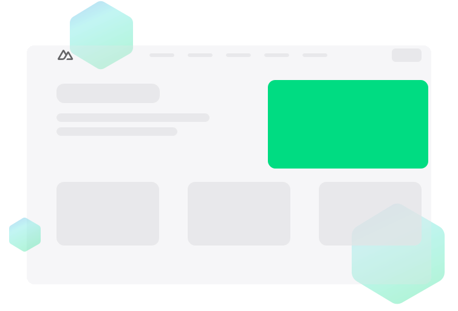
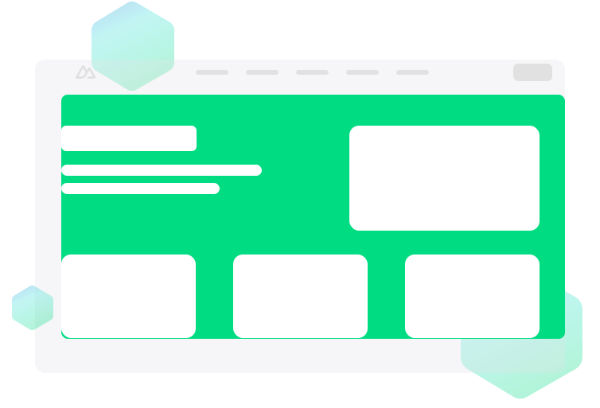
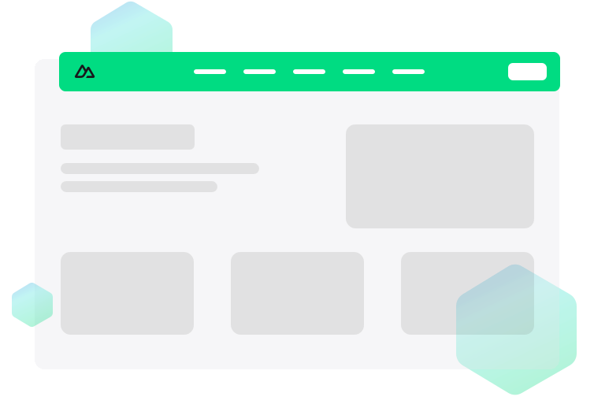

# Views
Nuxt はアプリケーションのユーザインタフェースを実装するためにいくつかのコンポーネントレイヤを提供します。

## `app.vue`


デフォルトでは、Nuxt はこのファイルをエントリーポイントとして扱い、アプリケーションの全てのルートに対してそのコンテンツをレンダリングします。
```Vue
<template>
    <div>
        <h1> Welcome to the homepage</h1>
    </div>
</template>
```
Vue に慣れている人なら、`main.js` （通常 Vue アプリを作成するファイル）がどこにあるのかと不思議に思うかもしれません。Nuxt はこれを舞台裏で行なっています。

## Components


ほとんどのコンポーネントはボタンやメニューのようなユーザインタフェースの再利用可能な部分です。Nuxt では、これらのコンポーネントを `components/` ディレクトリに作成でき、明示的にインポートしなくてもアプリケーション全体で自動的に使用できるようになります。
```Vue
<template>
    <div>
        <h1> Welcome to the homepage</h1>
        <AppAlert>
            This is an auto-imported component.
        </AppAlert>
    </div>
</template>
```
```Vue
<template>
    <span>
        <slot />
    </span>
</template>
```

## Pages


ページは特定のルートパターンごとに使用されるビューを表します。`pages/` ディレクトリにある全てのファイルはそのコンテンツを表示する異なるルートを表します。

ページを利用するには、`pages/index.vue` ファイルを作成し、`app.vue` に `<NuxtPage />` コンポーネントを追加します（または、デフォルトのエントリーの `app.vue` を削除してください）。`pages/` ディレクトリに新しいファイルを追加することで、さらにページとそれに対応するルートを作成することができます。
```Vue
<template>
  <div>
    <h1>Welcome to the homepage</h1>
    <AppAlert>
      This is an auto-imported component
    </AppAlert>
  </div>
</template>
```
```Vue
<template>
  <section>
    <p>This page will be displayed at the /about route.</p>
  </section>
</template>
```
詳細は[こちら](https://nuxt.com/docs/getting-started/routing)

## Layouts

レイアウトはヘッダーやフッターの表示など、複数のページで共通のユーザインタフェースを含むページのラッパーです。レイアウトはページのコンテンツを表示するための `<slot />` を使用した Vue ファイルです。`layouts/default.vue` ファイルがデフォルトでは使用されています。カスタムレイアウトは、ページのメタデータの一部として設定できます。

アプリケーションにレイアウトが1つしかない場合、代わりに `app.vue` と `<NuxtPage />` コンポーネントを使用することをお勧めします。

```Vue
<template>
  <div>
    <AppHeader />
    <slot />
    <AppFooter />
  </div>
</template>
```
```Vue
<template>
  <div>
    <h1>Welcome to the homepage</h1>
    <AppAlert>
      This is an auto-imported component
    </AppAlert>
  </div>
</template>
```
```Vue
<template>
  <section>
    <p>This page will be displayed at the /about route.</p>
  </section>
</template>
```
より多くのレイアウトを作成し、ページでの使用方法について学びたい場合は[こちら](https://nuxt.com/docs/guide/directory-structure/layouts)